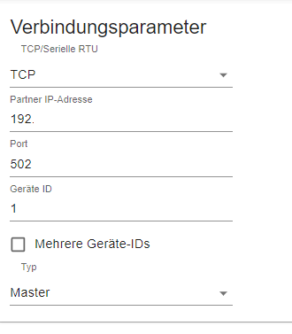
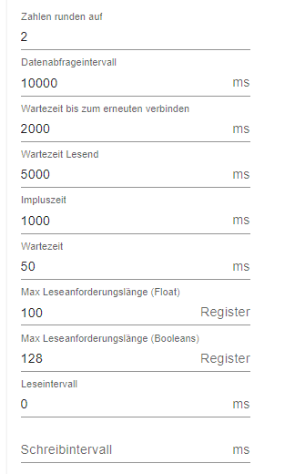

# Sungrow Hybrid Wechselrichter SH8.0RT

---------------------------------------------------------

## Weitere kompatible Sungrow Wechselrichter:
- SH5K-20
- SH3K6
- SH4K6
- SH5K-V13
- SH5K-30
- SH3K6-30
- SH4K6-30
- SH5.0RS
- SH3.6RS
- SH4.6RS
- SH6.0RS
- SH10RT
- SH8.0RT
- SH6.0RT
- SH5.0RT

---------------------------------------------------------

## Einstellungen im Modbus-Adapter:

